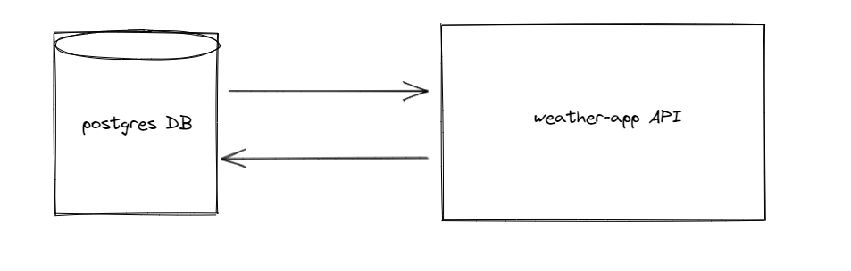
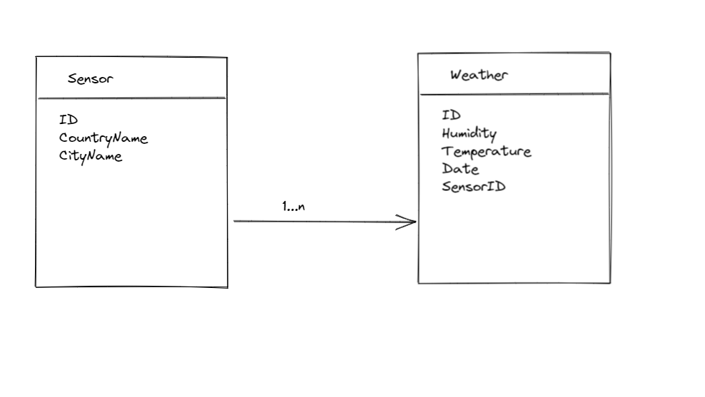

# weather-app

***Run Locally:***

If running locally you must have Docker installed

1.mvn clean install

2.docker-compose up

---

***System Architecture***



---

***Database ERD diagram***



---

***Endpoints***

POST: /sensor/register

Request

```
{
    "sensorId": "asdfasdf2",
    "countryName": "Ireland",
    "cityName": "Galway"
}
```

Response

````
{
    "message": "Success",
    "sensor": {
        "id": "ce65a63f-a8e6-4938-a562-a5ba52417c91",
        "countryName": "Ireland",
        "cityName": "Galway",
        "sensorId": "asdfasdf2",
        "metrics": null
    }
}
````

----

GET: /sensor Path

param: id (e.g. id=asdfasdf2)

Response

````
{
    "message": "Success",
    "sensor": {
        "id": "ce65a63f-a8e6-4938-a562-a5ba52417c91",
        "countryName": "Ireland",
        "cityName": "Galway",
        "sensorId": "asdfasdf2",
        "metrics": []
    }
}
````

---

POST: /sensor/metrics/get

Request

````
{
    "sensorIds": ["asdfasdf", ...],
    "startDate": "2022-03-17",
    "endDate": "2022-05-17"
}
````

Response

````
{
    "message": "Success",
    "metrics": {
        "temperature": 24,
        "humidity": 16
    }
}
````

---

POST: /sensor/metrics

Request

```
{
    "temperature": 50,
    "humidity": 22,
    "sensorId": "asdfasdf2",
    "date": "2022-04-01"
}
`````

Response

````
{
    "metrics": {
        "temperature": 50,
        "humidity": 22
    },
    "message": "Success"
}
````

---

***Nice to haves / Optimizations***

- Metrics table
- Pagination
- More testing! (integration tests specifically)
- Security
- Better exception handling such as using Spring's Controller Advice for better responses